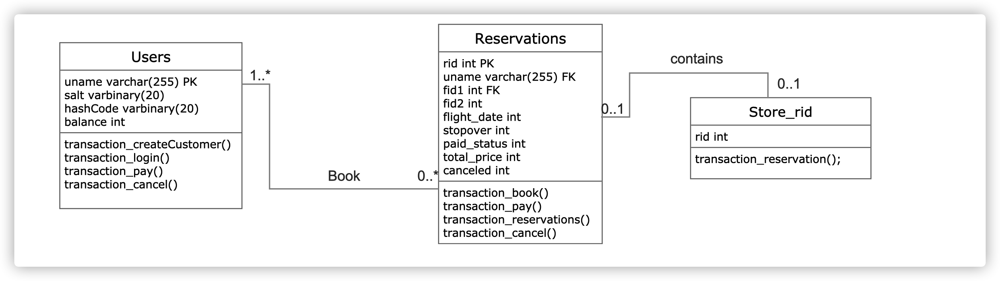

<!-- PROJECT LOGO -->

   
  

  <h3 align="center">Flight Seating Application</h3>

  

   :yellow_heart:To gain experience about database and Java JDBC:yellow_heart:
   
   
  

## :airplane:  About the Program
In this flight seating application, it allows customers to use a CLI to search, book, cancel, etc. flights.
Azure Mysql database is connected to save the customers and the flight they took.

## :hammer:  Tools Used in the Program
* SQL Server through SQL Azure
* Mavan
* Java JDBC
* Git

## Data Model
* Users: A user has a username(case insensitive), password(case sensitive), and balance in their account.
* Reservations: A booking for an itinerary, which may consist of one (direct) or two (one-hop) flights. Each reservation can either be paid or unpaid, cancelled or not, and has a unique ID.
* Itineraries: An itinerary is either a direct flight (consisting of one flight: origin --> destination) or
a one-hop flight (consisting of two flights: origin --> stopover city, stopover city --> destination). Itineraries are returned by the search command.
 

## Transaction Management
Used SQL Transaction to gurentee ACID properties:
* 1
* 2
* 3

